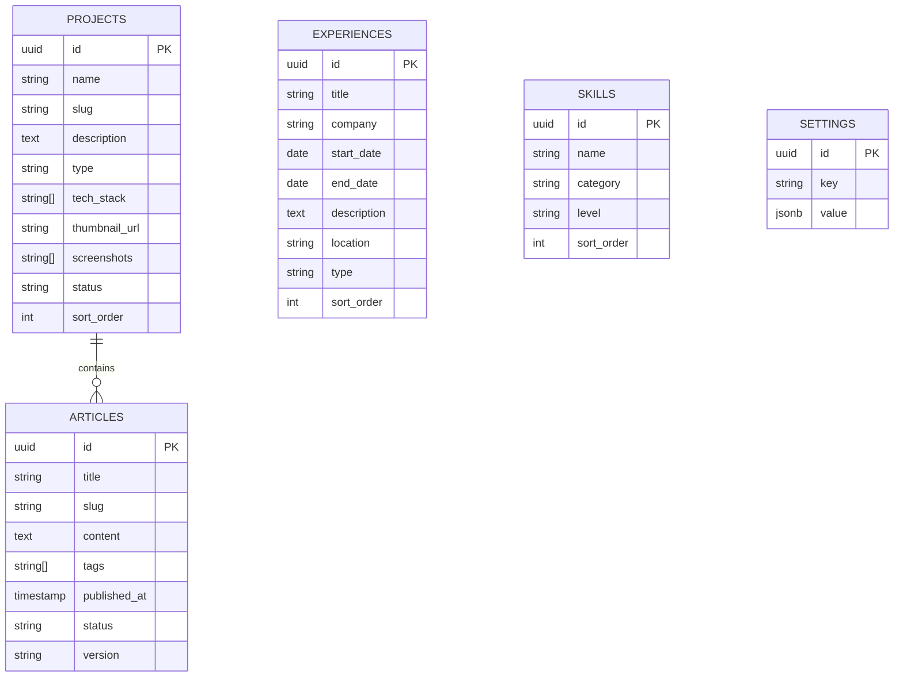

# 黄鑫哲个人品牌网站 - 数据库设计文档 v1.0

## 一、数据库概述

### 1.1 数据库选型

**Supabase PostgreSQL**

| 优势 | 说明 |
|-----|------|
| **开源** | 完全开源，可自托管 |
| **PostgreSQL** | 强大的关系型数据库 |
| **Realtime** | WebSocket 实时推送 |
| **Storage** | 对象存储服务 |
| **Auth** | 用户认证系统 |
| **Edge Functions** | Serverless 函数 |

### 1.2 数据库命名规范

| 类型 | 命名规则 | 示例 |
|-----|---------|------|
| **表名** | 复数、小写、下划线 | `projects`, `articles` |
| **字段名** | 小写、下划线 | `first_name`, `created_at` |
| **索引** | `idx_表名_字段名` | `idx_projects_slug` |
| **主键** | `id` (UUID) | `id UUID PRIMARY KEY` |
| **外键** | `表名_id` | `project_id` |

---

## 二、数据库表结构

### 2.1 projects 表（项目）

**用途**：存储项目作品信息

```sql
CREATE TABLE projects (
  -- 主键
  id UUID PRIMARY KEY DEFAULT gen_random_uuid(),
  
  -- 基础信息
  name VARCHAR(100) NOT NULL,
  slug VARCHAR(100) UNIQUE NOT NULL,
  description TEXT NOT NULL,
  short_description VARCHAR(200),
  
  -- 分类信息
  type VARCHAR(50) NOT NULL,
  tech_stack TEXT[] NOT NULL,
  role VARCHAR(50) NOT NULL,
  
  -- 链接信息
  url VARCHAR(500),
  demo_url VARCHAR(500),
  bp_url VARCHAR(500),
  thumbnail_url VARCHAR(500),
  screenshots TEXT[],
  
  -- 状态信息
  status VARCHAR(20) DEFAULT 'active',
  sort_order INTEGER DEFAULT 0,
  
  -- 时间戳
  created_at TIMESTAMP WITH TIME ZONE DEFAULT NOW(),
  updated_at TIMESTAMP WITH TIME ZONE DEFAULT NOW()
);

-- 创建索引
CREATE INDEX idx_projects_slug ON projects(slug);
CREATE INDEX idx_projects_status ON projects(status);
CREATE INDEX idx_projects_type ON projects(type);
CREATE INDEX idx_projects_sort_order ON projects(sort_order);

-- 启用 RLS
ALTER TABLE projects ENABLE ROW LEVEL SECURITY;

-- RLS 策略
CREATE POLICY "允许公开读取" ON projects FOR SELECT USING (true);
CREATE POLICY "允许 authenticated 写入" ON projects FOR ALL USING (auth.role() = 'authenticated');
```

**字段说明**：

| 字段 | 类型 | 必填 | 说明 |
|-----|------|------|------|
| `id` | UUID | ✅ | 主键 |
| `name` | VARCHAR(100) | ✅ | 项目名称 |
| `slug` | VARCHAR(100) | ✅ | URL slug，用于 SEO |
| `description` | TEXT | ✅ | 详细描述 |
| `short_description` | VARCHAR(200) | ❌ | 简短描述 |
| `type` | VARCHAR(50) | ✅ | 项目类型（AI产品/开源项目/商业项目） |
| `tech_stack` | TEXT[] | ✅ | 技术栈数组 |
| `role` | VARCHAR(50) | ✅ | 角色（创始人/产品负责/开发） |
| `url` | VARCHAR(500) | ❌ | 官网链接 |
| `demo_url` | VARCHAR(500) | ❌ | Demo 链接 |
| `bp_url` | VARCHAR(500) | ❌ | 商业计划书链接 |
| `thumbnail_url` | VARCHAR(500) | ❌ | 缩略图 URL |
| `screenshots` | TEXT[] | ❌ | 截图 URL 数组 |
| `status` | VARCHAR(20) | ❌ | 状态（active/draft/archived） |
| `sort_order` | INTEGER | ❌ | 排序顺序 |
| `created_at` | TIMESTAMP | ❌ | 创建时间 |
| `updated_at` | TIMESTAMP | ❌ | 更新时间 |

**示例数据**：

```sql
INSERT INTO projects (
  name,
  slug,
  description,
  short_description,
  type,
  tech_stack,
  role,
  url,
  demo_url,
  bp_url,
  thumbnail_url,
  screenshots,
  status,
  sort_order
) VALUES (
  'Claw OS',
  'claw-os',
  '本地个人AI操作系统，基于OpenClaw多智能体中枢，构建端侧Second Brain，实现感知-反射-认知-记忆四层闭环架构',
  'Local-First个人AI操作系统 | Multi-agent架构 | 开源项目',
  'AI产品',
  '{"OpenClaw", "RAG", "Vector DB", "Ollama", "MCP Protocol"}',
  '创始人',
  'https://github.com/your-username/claw-os',
  NULL,
  NULL,
  '/images/projects/claw-os-thumb.png',
  '["/images/projects/claw-os-1.png", "/images/projects/claw-os-2.png"]',
  'active',
  0
), (
  'Startup Hub',
  'startup-hub',
  'AI-Native创业匹配平台，基于LLM解析BP文档，自动提取非标准价值信号，服务早期创业团队招募场景',
  'AI创业团队招募平台 | 独立全栈开发 | Vibe Coding实践',
  '商业项目',
  '{"Vercel", "Supabase", "Claude Code", "GPT-4"}',
  '创始人',
  'https://startup-hub-woad.vercel.app/',
  NULL,
  NULL,
  '/images/projects/startup-hub-thumb.png',
  '["/images/projects/startup-hub-1.png", "/images/projects/startup-hub-2.png"]',
  'active',
  1
), (
  '问记',
  'wenji',
  '探索式学习AI Agent，非线性对话泳道式交互，支持多轮对话记忆与知识图谱构建',
  '探索式学习AI Agent | 非线性对话 | 泳道式交互',
  'AI产品',
  '{"Coze", "RAG", "Prompt Engineering"}',
  '产品负责',
  'https://wenji-39846361924.us-west1.run.app/',
  NULL,
  NULL,
  '/images/projects/wenji-thumb.png',
  '["/images/projects/wenji-1.png", "/images/projects/wenji-2.png"]',
  'active',
  2
);
```

---

### 2.2 articles 表（文章）

**用途**：存储思考文章、项目介绍、未来展望

```sql
CREATE TABLE articles (
  -- 主键
  id UUID PRIMARY KEY DEFAULT gen_random_uuid(),
  
  -- 基础信息
  title VARCHAR(200) NOT NULL,
  slug VARCHAR(200) UNIQUE NOT NULL,
  content TEXT NOT NULL,
  excerpt VARCHAR(500),
  
  -- 分类信息
  tags VARCHAR(50)[],
  published_at TIMESTAMP WITH TIME ZONE DEFAULT NOW(),
  
  -- 状态信息
  status VARCHAR(20) DEFAULT 'published',
  version VARCHAR(20),
  
  -- 时间戳
  created_at TIMESTAMP WITH TIME ZONE DEFAULT NOW(),
  updated_at TIMESTAMP WITH TIME ZONE DEFAULT NOW()
);

-- 创建索引
CREATE INDEX idx_articles_slug ON articles(slug);
CREATE INDEX idx_articles_status ON articles(status);
CREATE INDEX idx_articles_published_at ON articles(published_at);
CREATE INDEX idx_articles_tags ON articles USING GIN(tags);

-- 启用 RLS
ALTER TABLE articles ENABLE ROW LEVEL SECURITY;

-- RLS 策略
CREATE POLICY "允许公开读取" ON articles FOR SELECT USING (true);
CREATE POLICY "允许 authenticated 写入" ON articles FOR ALL USING (auth.role() = 'authenticated');
```

**字段说明**：

| 字段 | 类型 | 必填 | 说明 |
|-----|------|------|------|
| `id` | UUID | ✅ | 主键 |
| `title` | VARCHAR(200) | ✅ | 文章标题 |
| `slug` | VARCHAR(200) | ✅ | URL slug |
| `content` | TEXT | ✅ | 文章内容（Markdown） |
| `excerpt` | VARCHAR(500) | ❌ | 摘要 |
| `tags` | VARCHAR(50)[] | ❌ | 标签数组 |
| `published_at` | TIMESTAMP | ❌ | 发布时间 |
| `status` | VARCHAR(20) | ❌ | 状态（published/draft） |
| `version` | VARCHAR(20) | ❌ | 版本号（如 v260302.1） |
| `created_at` | TIMESTAMP | ❌ | 创建时间 |
| `updated_at` | TIMESTAMP | ❌ | 更新时间 |

**示例数据**：

```sql
INSERT INTO articles (
  title,
  slug,
  content,
  excerpt,
  tags,
  published_at,
  status,
  version
) VALUES (
  'AI Agent的下一个形态',
  'ai-agent-next-evolution',
  '# AI Agent的下一个形态\n\n## 引言\n\n当我对AI Agent的理解发生了新的变化...\n\n## 核心观点\n\n1. **认知升级**：从工具到伙伴\n2. **架构演进**：从单体到网络\n3. **交互革命**：从命令到对话\n\n## 未来展望\n\n...\n\n## 结语\n\n...\n',
  '当我对AI Agent的理解发生了新的变化...',
  '{"AI产品", "思考"}',
  '2026-03-02 12:00:00+08',
  'published',
  'v260302.1'
), (
  '为什么我要做Claw OS',
  'why-i-built-claw-os',
  '# 为什么我要做Claw OS\n\n## 起源\n\n这篇文章记录了我开始这个项目的初衷...\n\n## 核心理念\n\n1. **Local-First**：数据主权\n2. **Multi-Agent**：协同智能\n3. **Open-Source**：开源共享\n\n## 技术架构\n\n...\n\n## 结语\n\n...\n',
  '这篇文章记录了我开始这个项目的初衷...',
  '{"创业", "AI产品"}',
  '2026-03-01 12:00:00+08',
  'published',
  'v260301.1'
), (
  '关于我',
  'about-me',
  '# 关于我\n\n7年产品经理经验，专注AI Agent系统架构与Vibe Coding全栈落地...\n\n## 工作经历\n\n...\n\n## 技能清单\n\n...\n\n## 联系方式\n\n...\n',
  '7年产品经理经验，专注AI Agent系统架构与Vibe Coding全栈落地...',
  '{"关于我"}',
  '2026-03-01 12:00:00+08',
  'published',
  NULL
);
```

---

### 2.3 experiences 表（经历）

**用途**：存储工作经历、成长轨迹

```sql
CREATE TABLE experiences (
  -- 主键
  id UUID PRIMARY KEY DEFAULT gen_random_uuid(),
  
  -- 基础信息
  title VARCHAR(100) NOT NULL,
  subtitle VARCHAR(100),
  company VARCHAR(100),
  
  -- 时间信息
  start_date DATE NOT NULL,
  end_date DATE,
  
  -- 描述信息
  description TEXT,
  location VARCHAR(100),
  
  -- 分类信息
  type VARCHAR(50) NOT NULL,
  
  -- 排序信息
  sort_order INTEGER DEFAULT 0,
  
  -- 时间戳
  created_at TIMESTAMP WITH TIME ZONE DEFAULT NOW(),
  updated_at TIMESTAMP WITH TIME ZONE DEFAULT NOW()
);

-- 创建索引
CREATE INDEX idx_experiences_sort_order ON experiences(sort_order);
CREATE INDEX idx_experiences_type ON experiences(type);

-- 启用 RLS
ALTER TABLE experiences ENABLE ROW LEVEL SECURITY;

-- RLS 策略
CREATE POLICY "允许公开读取" ON experiences FOR SELECT USING (true);
CREATE POLICY "允许 authenticated 写入" ON experiences FOR ALL USING (auth.role() = 'authenticated');
```

**字段说明**：

| 字段 | 类型 | 必填 | 说明 |
|-----|------|------|------|
| `id` | UUID | ✅ | 主键 |
| `title` | VARCHAR(100) | ✅ | 职位标题 |
| `subtitle` | VARCHAR(100) | ❌ | 副标题（项目/成就） |
| `company` | VARCHAR(100) | ❌ | 公司名称 |
| `start_date` | DATE | ✅ | 开始日期 |
| `end_date` | DATE | ❌ | 结束日期 |
| `description` | TEXT | ❌ | 描述 |
| `location` | VARCHAR(100) | ❌ | 工作地点 |
| `type` | VARCHAR(50) | ✅ | 类型（工作/项目/学习） |
| `sort_order` | INTEGER | ❌ | 排序顺序 |
| `created_at` | TIMESTAMP | ❌ | 创建时间 |
| `updated_at` | TIMESTAMP | ❌ | 更新时间 |

**示例数据**：

```sql
INSERT INTO experiences (
  title,
  subtitle,
  company,
  start_date,
  end_date,
  description,
  location,
  type,
  sort_order
) VALUES (
  'AI创业者',
  '连续创业 / 智慧养老 / 智慧文旅 / AI-Native应用',
  NULL,
  '2025-01-01',
  NULL,
  '从0到1搭建AI创业服务平台，完成3个产品迭代；探索AI在银发经济与文化传承场景的应用',
  '杭州',
  '工作',
  0
), (
  'Claw OS - 本地个人AI操作系统',
  '开源项目 / Multi-agent架构',
  NULL,
  '2025-06-01',
  NULL,
  '架构设计Local-First个人AI操作系统；设计多智能体语义路由；建立模型分层策略；设计Life Stream数字孪生；建立隐私计算架构；基于MCP协议扩展',
  '杭州',
  '项目',
  1
), (
  'Startup Hub - AI-Native创业匹配平台',
  '线上产品 / 独立全栈开发',
  NULL,
  '2025-11-01',
  NULL,
  '使用Vibe Coding流程（Figma设计→Claude Code开发→Vercel部署），7天内完成MVP上线；设计AI数字档案系统；产品功能：项目展示中心、AI匹配算法、私信系统',
  '杭州',
  '项目',
  2
), (
  '产品经理',
  '中国电建中南勘测设计研究院 / 智慧工地协同中台',
  '中国电建中南勘测设计研究院',
  '2024-05-01',
  '2025-02-01',
  '主导水电站数字孪生项目；AI应用落地：嵌入计算机视觉算法；B端系统设计：协同中台产品架构设计',
  '长沙',
  '工作',
  3
), (
  '产品经理',
  '湖南羊驼教育网络科技 / 网校系统大版本更新、ERP系统从0到1',
  '湖南羊驼教育网络科技',
  '2021-11-01',
  '2024-03-01',
  '从0到1搭建内部ERP系统，覆盖招生-教学-财务全业务链；课消系统减少财务部门20%工作量；新生入校系统减少班主任部门50%人力投入',
  '长沙',
  '工作',
  4
);
```

---

### 2.4 skills 表（技能）

**用途**：存储技能清单

```sql
CREATE TABLE skills (
  -- 主键
  id UUID PRIMARY KEY DEFAULT gen_random_uuid(),
  
  -- 基础信息
  name VARCHAR(50) NOT NULL,
  category VARCHAR(50) NOT NULL,
  
  -- 等级信息
  level VARCHAR(20) DEFAULT 'intermediate',
  
  -- 排序信息
  sort_order INTEGER DEFAULT 0,
  
  -- 时间戳
  created_at TIMESTAMP WITH TIME ZONE DEFAULT NOW(),
  updated_at TIMESTAMP WITH TIME ZONE DEFAULT NOW()
);

-- 创建索引
CREATE INDEX idx_skills_category ON skills(category);
CREATE INDEX idx_skills_sort_order ON skills(sort_order);

-- 启用 RLS
ALTER TABLE skills ENABLE ROW LEVEL SECURITY;

-- RLS 策略
CREATE POLICY "允许公开读取" ON skills FOR SELECT USING (true);
CREATE POLICY "允许 authenticated 写入" ON skills FOR ALL USING (auth.role() = 'authenticated');
```

**字段说明**：

| 字段 | 类型 | 必填 | 说明 |
|-----|------|------|------|
| `id` | UUID | ✅ | 主键 |
| `name` | VARCHAR(50) | ✅ | 技能名称 |
| `category` | VARCHAR(50) | ✅ | 分类（AI工具/Agent平台/开发工具/设计工具/产品工具/部署运维） |
| `level` | VARCHAR(20) | ❌ | 等级（beginner/intermediate/expert） |
| `sort_order` | INTEGER | ❌ | 排序顺序 |
| `created_at` | TIMESTAMP | ❌ | 创建时间 |
| `updated_at` | TIMESTAMP | ❌ | 更新时间 |

**示例数据**：

```sql
INSERT INTO skills (name, category, level, sort_order) VALUES
-- AI工具
('ChatGPT', 'AI工具', 'expert', 0),
('Claude', 'AI工具', 'expert', 1),
('DeepSeek', 'AI工具', 'expert', 2),
('通义千问', 'AI工具', 'expert', 3),
('Kimi', 'AI工具', 'expert', 4),
('GLM', 'AI工具', 'expert', 5),
('豆包', 'AI工具', 'intermediate', 6),

-- Agent平台
('Coze', 'Agent平台', 'expert', 0),
('Manus', 'Agent平台', 'expert', 1),
('豆包', 'Agent平台', 'intermediate', 2),

-- 开发工具
('Claude Code', '开发工具', 'expert', 0),
('Kimi Code', '开发工具', 'expert', 1),
('Cursor', '开发工具', 'expert', 2),
('GitHub Copilot', '开发工具', 'expert', 3),

-- 设计工具
('Figma', '设计工具', 'expert', 0),
('Axure', '设计工具', 'expert', 1),
('MasterGo', '设计工具', 'intermediate', 2),

-- 产品工具
('飞书', '产品工具', 'expert', 0),
('Xmind', '产品工具', 'expert', 1),

-- 部署运维
('Vercel', '部署运维', 'expert', 0),
('Supabase', '部署运维', 'expert', 1),
('Firebase', '部署运维', 'intermediate', 2),

-- 数据分析
('SQL', '数据分析', 'expert', 0),
('数据埋点', '数据分析', 'intermediate', 1),
('漏斗分析', '数据分析', 'intermediate', 2);
```

---

### 2.5 settings 表（网站设置）

**用途**：存储网站全局设置

```sql
CREATE TABLE settings (
  -- 主键
  id UUID PRIMARY KEY DEFAULT gen_random_uuid(),
  
  -- 基础信息
  key VARCHAR(50) UNIQUE NOT NULL,
  value JSONB NOT NULL,
  
  -- 描述信息
  description VARCHAR(200),
  
  -- 时间戳
  updated_at TIMESTAMP WITH TIME ZONE DEFAULT NOW()
);

-- 启用 RLS
ALTER TABLE settings ENABLE ROW LEVEL SECURITY;

-- RLS 策略
CREATE POLICY "允许公开读取" ON settings FOR SELECT USING (true);
CREATE POLICY "允许 authenticated 写入" ON settings FOR ALL USING (auth.role() = 'authenticated');
```

**字段说明**：

| 字段 | 类型 | 必填 | 说明 |
|-----|------|------|------|
| `id` | UUID | ✅ | 主键 |
| `key` | VARCHAR(50) | ✅ | 设置键名 |
| `value` | JSONB | ✅ | 设置值（JSON 格式） |
| `description` | VARCHAR(200) | ❌ | 描述 |
| `updated_at` | TIMESTAMP | ❌ | 更新时间 |

**示例数据**：

```sql
INSERT INTO settings (key, value, description) VALUES
-- Hero 区设置
('hero', '{"title": "黄鑫哲", "subtitle": "AI Product Manager", "description": "7年产品经理经验 | 独立开发过AI产品 | 正在寻找杭州/上海的机会"}', 'Hero 区设置'),

-- 导航栏设置
('navbar', '{"links": [{"name": "首页", "href": "/"}, {"name": "项目", "href": "/projects"}, {"name": "关于我", "href": "/about"}, {"name": "未来展望", "href": "/thoughts"}, {"name": "联系方式", "href": "/contact"}]}', '导航栏设置'),

-- 页脚设置
('footer', '{"copyright": "© 2026 黄鑫哲. All rights reserved.", "location": "杭州", "message": "Always building something new."}', '页脚设置'),

-- 社交链接设置
('social', '{"github": "https://github.com/your-username", "linkedin": "https://linkedin.com/in/your-profile", "email": "Cyberxz2077@gmail.com", "phone": "13142263877", "wechat": "Hi_Cortana"}', '社交链接设置');
```

---

## 三、数据库关系图

```
┌─────────────────┐
│    projects     │
├─────────────────┤
│ id (PK)         │
│ name            │
│ slug            │
│ description     │
│ type            │
│ tech_stack []   │
│ thumbnail_url   │
│ screenshots []  │
│ status          │
│ sort_order      │
└─────────────────┘

┌─────────────────┐
│    articles     │
├─────────────────┤
│ id (PK)         │
│ title           │
│ slug            │
│ content         │
│ tags []         │
│ published_at    │
│ status          │
│ version         │
└─────────────────┘

┌─────────────────┐
│   experiences   │
├─────────────────┤
│ id (PK)         │
│ title           │
│ company         │
│ start_date      │
│ end_date        │
│ description     │
│ type            │
│ sort_order      │
└─────────────────┘

┌─────────────────┐
│     skills      │
├─────────────────┤
│ id (PK)         │
│ name            │
│ category        │
│ level           │
│ sort_order      │
└─────────────────┘

┌─────────────────┐
│    settings     │
├─────────────────┤
│ id (PK)         │
│ key             │
│ value (JSONB)   │
└─────────────────┘
```

---

## 四、数据库索引策略

### 4.1 单列索引

```sql
-- projects 表
CREATE INDEX idx_projects_slug ON projects(slug);
CREATE INDEX idx_projects_status ON projects(status);
CREATE INDEX idx_projects_type ON projects(type);
CREATE INDEX idx_projects_sort_order ON projects(sort_order);

-- articles 表
CREATE INDEX idx_articles_slug ON articles(slug);
CREATE INDEX idx_articles_status ON articles(status);
CREATE INDEX idx_articles_published_at ON articles(published_at);

-- experiences 表
CREATE INDEX idx_experiences_sort_order ON experiences(sort_order);
CREATE INDEX idx_experiences_type ON experiences(type);

-- skills 表
CREATE INDEX idx_skills_category ON skills(category);
CREATE INDEX idx_skills_sort_order ON skills(sort_order);
```

### 4.2 复合索引

```sql
-- 项目按状态和排序查询
CREATE INDEX idx_projects_status_order ON projects(status, sort_order);

-- 文章按状态和发布时间查询
CREATE INDEX idx_articles_status_published ON articles(status, published_at);

-- 经历按类型和排序查询
CREATE INDEX idx_experiences_type_order ON experiences(type, sort_order);

-- 技能按分类和排序查询
CREATE INDEX idx_skills_category_order ON skills(category, sort_order);
```

### 4.3 全文索引

```sql
-- articles 表全文搜索
CREATE INDEX idx_articles_content_ts ON articles USING GIN(to_tsvector('simple', content));

-- projects 表全文搜索
CREATE INDEX idx_projects_description_ts ON projects USING GIN(to_tsvector('simple', description));
```

---

## 五、数据验证规则

### 5.1 检查约束

```sql
-- projects 表
ALTER TABLE projects 
ADD CONSTRAINT chk_projects_status CHECK (status IN ('active', 'draft', 'archived'));

ALTER TABLE projects 
ADD CONSTRAINT chk_projects_type CHECK (type IN ('AI产品', '开源项目', '商业项目', '实验项目'));

-- articles 表
ALTER TABLE articles 
ADD CONSTRAINT chk_articles_status CHECK (status IN ('published', 'draft'));

-- experiences 表
ALTER TABLE experiences 
ADD CONSTRAINT chk_experiences_type CHECK (type IN ('工作', '项目', '学习', '其他'));

-- skills 表
ALTER TABLE skills 
ADD CONSTRAINT chk_skills_level CHECK (level IN ('beginner', 'intermediate', 'expert'));
```

### 5.2 唯一约束

```sql
-- projects 表
ALTER TABLE projects 
ADD CONSTRAINT uq_projects_slug UNIQUE (slug);

-- articles 表
ALTER TABLE articles 
ADD CONSTRAINT uq_articles_slug UNIQUE (slug);

-- settings 表
ALTER TABLE settings 
ADD CONSTRAINT uq_settings_key UNIQUE (key);
```

---

## 六、数据迁移策略

### 6.1 初始数据填充

```sql
-- 1. 填充项目数据
INSERT INTO projects (...) VALUES (...);

-- 2. 填充文章数据
INSERT INTO articles (...) VALUES (...);

-- 3. 填充经历数据
INSERT INTO experiences (...) VALUES (...);

-- 4. 填充技能数据
INSERT INTO skills (...) VALUES (...);

-- 5. 填充设置数据
INSERT INTO settings (...) VALUES (...);
```

### 6.2 数据备份策略

```sql
-- 备份整个数据库
pg_dump -U supabase_admin -d postgres -F c -f backup.sql

-- 备份特定表
pg_dump -U supabase_admin -d postgres -t projects -t articles -t experiences -t skills -F c -f content_backup.sql
```

---

## 七、数据库安全策略

### 7.1 RLS 策略

**已启用 RLS 的表**：
- `projects`
- `articles`
- `experiences`
- `skills`
- `settings`

**RLS 策略**：
```sql
-- 公开读取
CREATE POLICY "允许公开读取" ON table_name FOR SELECT USING (true);

-- 认证用户写入
CREATE POLICY "允许 authenticated 写入" ON table_name FOR ALL USING (auth.role() = 'authenticated');
```

### 7.2 数据加密

**敏感信息加密**：
- API 密钥
- 用户数据
- 日志信息

**加密方案**：
- 使用 Supabase Vault
- 使用 PostgreSQL pgcrypto 扩展

---

## 八、数据库性能优化

### 8.1 查询优化

**避免 N+1 查询**：
```sql
-- ❌ 错误方式
SELECT * FROM projects;
SELECT * FROM skills WHERE category = (SELECT category FROM projects WHERE id = ...);

-- ✅ 正确方式
SELECT p.*, s.*
FROM projects p
LEFT JOIN skills s ON s.category = ANY(p.tech_stack);
```

**使用索引**：
```sql
-- 确保查询使用索引
EXPLAIN SELECT * FROM projects WHERE status = 'active' ORDER BY sort_order;
```

### 8.2 连接优化

**使用 JOIN 代替子查询**：
```sql
-- ❌ 子查询
SELECT * FROM projects WHERE id IN (SELECT project_id FROM skills WHERE category = 'AI产品');

-- ✅ JOIN
SELECT DISTINCT p.*
FROM projects p
INNER JOIN skills s ON s.category = ANY(p.tech_stack)
WHERE s.category = 'AI产品';
```

---

## 九、数据库监控

### 9.1 性能监控

**查询性能**：
```sql
-- 查看慢查询
SELECT * FROM pg_stat_statements ORDER BY mean_exec_time DESC LIMIT 10;

-- 查看索引使用情况
SELECT schemaname, tablename, indexrelname, idx_scan, idx_tup_read
FROM pg_stat_user_indexes
ORDER BY idx_scan ASC;
```

### 9.2 连接监控

**查看连接数**：
```sql
SELECT count(*) FROM pg_stat_activity;
```

**设置连接限制**：
```sql
ALTER DATABASE postgres SET max_connections = 100;
```

---

## 十、数据库备份与恢复

### 10.1 自动备份

**Supabase 自动备份**：
- 每小时增量备份
- 每日全量备份
- 保留 30 天

### 10.2 手动备份

```bash
# 备份数据库
supabase db dump -f backup.sql

# 恢复数据库
supabase db restore -f backup.sql
```

---

## 十一、数据库版本管理

### 11.1 迁移脚本

```bash
# 创建迁移
supabase migration new create_projects_table

# 应用迁移
supabase migration up

# 回滚迁移
supabase migration down
```

### 11.2 版本控制

```sql
-- 创建版本表
CREATE TABLE db_version (
  version VARCHAR(20) PRIMARY KEY,
  applied_at TIMESTAMP WITH TIME ZONE DEFAULT NOW()
);

-- 插入版本
INSERT INTO db_version (version) VALUES ('v1.0');
```

---

## 十二、数据库文档

### 12.1 ERD 图



### 12.2 字段说明

| 表名 | 字段 | 类型 | 说明 |
|-----|------|------|------|
| projects | id | UUID | 主键 |
| projects | name | VARCHAR(100) | 项目名称 |
| projects | slug | VARCHAR(100) | URL slug |
| projects | description | TEXT | 详细描述 |
| projects | type | VARCHAR(50) | 项目类型 |
| projects | tech_stack | TEXT[] | 技术栈数组 |
| projects | thumbnail_url | VARCHAR(500) | 缩略图 URL |
| projects | screenshots | TEXT[] | 截图 URL 数组 |
| projects | status | VARCHAR(20) | 状态 |
| projects | sort_order | INTEGER | 排序顺序 |
| articles | id | UUID | 主键 |
| articles | title | VARCHAR(200) | 文章标题 |
| articles | slug | VARCHAR(200) | URL slug |
| articles | content | TEXT | 文章内容 |
| articles | tags | VARCHAR(50)[] | 标签数组 |
| articles | published_at | TIMESTAMP | 发布时间 |
| articles | status | VARCHAR(20) | 状态 |
| articles | version | VARCHAR(20) | 版本号 |
| experiences | id | UUID | 主键 |
| experiences | title | VARCHAR(100) | 职位标题 |
| experiences | company | VARCHAR(100) | 公司名称 |
| experiences | start_date | DATE | 开始日期 |
| experiences | end_date | DATE | 结束日期 |
| experiences | description | TEXT | 描述 |
| experiences | location | VARCHAR(100) | 工作地点 |
| experiences | type | VARCHAR(50) | 类型 |
| experiences | sort_order | INTEGER | 排序顺序 |
| skills | id | UUID | 主键 |
| skills | name | VARCHAR(50) | 技能名称 |
| skills | category | VARCHAR(50) | 分类 |
| skills | level | VARCHAR(20) | 等级 |
| skills | sort_order | INTEGER | 排序顺序 |
| settings | id | UUID | 主键 |
| settings | key | VARCHAR(50) | 设置键名 |
| settings | value | JSONB | 设置值 |

---

## 十三、数据库 API

### 13.1 Supabase Client

```typescript
// 初始化客户端
import { createClient } from '@supabase/supabase-js';

const supabase = createClient(
  process.env.NEXT_PUBLIC_SUPABASE_URL!,
  process.env.NEXT_PUBLIC_SUPABASE_ANON_KEY!
);

// 查询项目
const { data: projects, error } = await supabase
  .from('projects')
  .select('*')
  .eq('status', 'active')
  .order('sort_order', { ascending: true });

// 查询文章
const { data: articles, error } = await supabase
  .from('articles')
  .select('*')
  .eq('status', 'published')
  .order('published_at', { ascending: false });

// 查询经历
const { data: experiences, error } = await supabase
  .from('experiences')
  .select('*')
  .order('sort_order', { ascending: true });

// 查询技能
const { data: skills, error } = await supabase
  .from('skills')
  .select('*')
  .order('sort_order', { ascending: true });
```

### 13.2 查询示例

```typescript
// 查询所有项目
const projects = await supabase
  .from('projects')
  .select('*')
  .order('sort_order', { ascending: true });

// 查询单个项目
const project = await supabase
  .from('projects')
  .select('*')
  .eq('slug', 'claw-os')
  .single();

// 查询所有文章
const articles = await supabase
  .from('articles')
  .select('*')
  .eq('status', 'published')
  .order('published_at', { ascending: false });

// 查询单篇文章
const article = await supabase
  .from('articles')
  .select('*')
  .eq('slug', 'about-me')
  .single();

// 查询所有经历
const experiences = await supabase
  .from('experiences')
  .select('*')
  .order('sort_order', { ascending: true });

// 查询所有技能
const skills = await supabase
  .from('skills')
  .select('*')
  .order('sort_order', { ascending: true });

// 查询设置
const { data: settings, error } = await supabase
  .from('settings')
  .select('*');
```

---

## 十四、数据库测试

### 14.1 单元测试

```typescript
// tests/projects.test.ts
import { describe, it, expect, beforeEach } from 'vitest';
import { createClient } from '@supabase/supabase-js';

describe('Projects', () => {
  let supabase;
  
  beforeEach(() => {
    supabase = createClient(
      process.env.NEXT_PUBLIC_SUPABASE_URL!,
      process.env.NEXT_PUBLIC_SUPABASE_ANON_KEY!
    );
  });
  
  it('should fetch all projects', async () => {
    const { data, error } = await supabase
      .from('projects')
      .select('*');
    
    expect(error).toBeNull();
    expect(data).toBeArray();
  });
  
  it('should fetch project by slug', async () => {
    const { data, error } = await supabase
      .from('projects')
      .select('*')
      .eq('slug', 'claw-os')
      .single();
    
    expect(error).toBeNull();
    expect(data).toBeObject();
    expect(data.slug).toBe('claw-os');
  });
});
```

### 14.2 集成测试

```typescript
// tests/integration/projects.test.ts
import { describe, it, expect, beforeEach } from 'vitest';

describe('Projects API', () => {
  it('should return 200 for GET /api/projects', async () => {
    const res = await fetch('http://localhost:3000/api/projects');
    expect(res.status).toBe(200);
  });
  
  it('should return project by slug', async () => {
    const res = await fetch('http://localhost:3000/api/projects/claw-os');
    expect(res.status).toBe(200);
    
    const data = await res.json();
    expect(data.slug).toBe('claw-os');
  });
});
```

---

## 十五、数据库文档完成

**数据库设计文档完成！**
